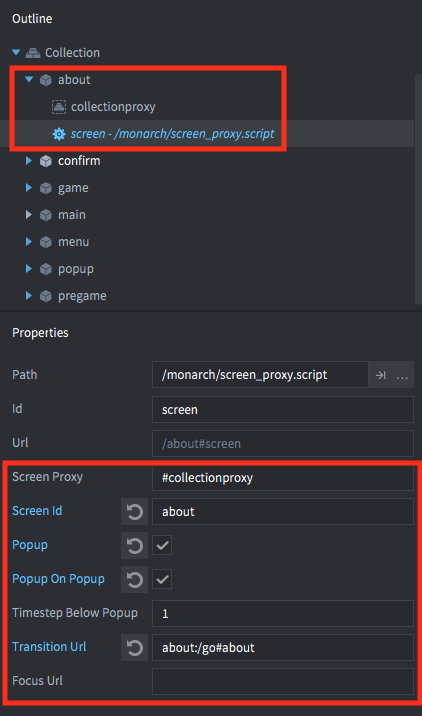
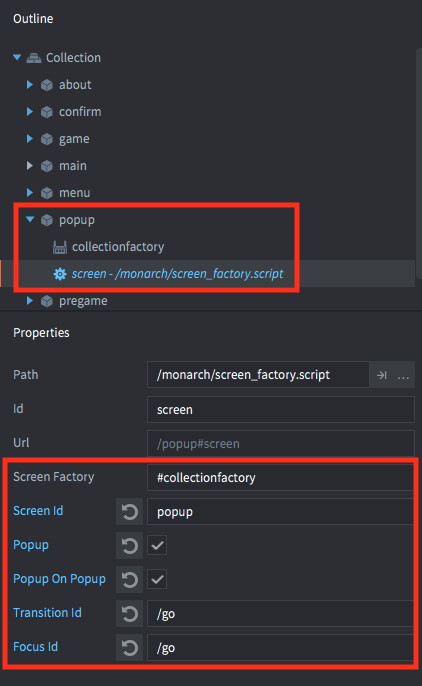

# Monarch
Monarch is a screen manager for the [Defold](https://www.defold.com) game engine.

# Installation
You can use Monarch in your own project by adding this project as a [Defold library dependency](http://www.defold.com/manuals/libraries/). Open your game.project file and in the dependencies field under project add:

https://github.com/britzl/monarch/archive/master.zip

Or point to the ZIP file of a [specific release](https://github.com/britzl/monarch/releases).

# Usage
Using Monarch requires that screens are created in a certain way. Once you have one or more screens created you can start navigating between the screens.

## Editor Script
Right click in on a`.gui` file in the outline and selected the menu item, it creates a `.collection` and a `.gui_script` with the same name as the `.gui` file. It adds the file with some basic setup done to them, adding the selected gui script to the created gui scene and in turns adds the gui scene to the newly created collection.

## Creating screens
Monarch screens are created in individual collections and either loaded through collection proxies or created through collection factories.

### Collection proxies
For proxies the recommended setup is to create one game object per screen and per game object attach a collection proxy component and an instance of the `screen_proxy.script` provided by Monarch. The `screen_proxy.script` will take care of the setup of the screen. All you need to do is to make sure that the script properties on the script are correct:

* **Screen Proxy (url)** - The URL to the collection proxy component containing the actual screen. Defaults to `#collectionproxy`.
* **Screen Id (hash)** - A unique id that can be used to reference the screen when navigating your app.
* **Popup (boolean)** - Check this if the screen should be treated as a [popup](#popups).
* **Popup on Popup (boolean)** - Check this if the screen is a [popup](#popups) and it can be shown on top of other popups.
* **Timestep below Popup (number)** - Timestep to set on screen proxy when it is below a popup. This is useful when pausing animations and gameplay while a popup is open.
* **Screen Keeps Input Focus When Below Popup (boolean)** - Check this if the screen should keep input focus when it is below a popup.
* **Others Keep Input Focus When Below Screen (boolean)** - Check this if other screens should keep input focus when below this screen.
* **Transition Url (url)** - Optional URL to post messages to when the screen is about to be shown/hidden. Use this to trigger a transition (see the section on [transitions](#transitions)).
* **Focus Url (url)** - Optional URL to post messages to when the screen gains or loses focus (see the section on [screen focus](#screen-focus-gainloss)).
* **Receiver Url (url)** - Optional URL to post messages to using `monarch.post()`.
* **Preload (boolean)** - Check this if the screen should be preloaded and kept loaded at all times. For a collection proxy it means that it will be async loaded but not enabled at all times while not visible. This can also temporarily be achieved through the `monarch.preload()` function.

### Collection factories
For factories the recommended setup is to create one game object per screen and per game object attach a collection factory component and an instance of the `screen_factory.script` provided by Monarch. The `screen_factory.script` will take care of the setup of the screen. All you need to do is to make sure that the script properties on the script are correct:

* **Screen Factory (url)** - The URL to the collection factory component containing the actual screen. Defaults to `#collectionfactory`.
* **Screen Id (hash)** - A unique id that can be used to reference the screen when navigating your app.
* **Popup (boolean)** - Check this if the screen should be treated as a [popup](#popups).
* **Popup on Popup (boolean)** - Check this if the screen is a [popup](#popups) and it can be shown on top of other popups.
* **Screen Keeps Input Focus When Below Popup (boolean)** - Check this if the screen should keep input focus when it is below a popup.
* **Others Keep Input Focus When Below Screen (boolean)** - Check this if other screens should keep input focus when below this screen.
* **Transition Id (hash)** - Optional id of the game object to send a message to when the screen is about to be shown/hidden. Use this to trigger a transition (see the section on [transitions](#transitions)).
* **Focus Id (hash)** - Optional id of the game object to send a message to when the screen gains or loses focus (see the section on [screen focus](#screen-focus-gainloss)).
* **Preload (boolean)** - Check this if the screen should be preloaded and kept loaded at all times. For a collection factory this means that its resources will be dynamically loaded at all times. This can also temporarily be achieved through the `monarch.preload()` function.

Note: Monarch supports dynamic collection factories (ie where the "Load Dynamically" checkbox is checked).

## Nesting screens
Sometimes it might be desirable to have a screen that contains one or more sub-screens or children, for instance popups that are used only by that screen. Monarch supports nested screens only when the parent screen is created via a collection factory. If the parent screen is loaded via a collection proxy the sub/child-screens won't be able to receive any input.

## Navigating between screens
The navigation in Monarch is based around a stack of screens. When a screen is shown it is pushed to the top of the stack. When going back to a previous screen the topmost screen on the stack is removed. Example:

* Showing screen A
* Stack is `[A]`
* Showing screen B
* Stack is `[A, B]` - (B is on top)
* Going back
* Stack is `[A]`

### Showing a new screen
You show a screen in one of two ways:

1. Post a `show` message to the screen script (either `screen_proxy.script` or `screen_factory.script`)
2. Call `monarch.show()` (see below)

Showing a screen will push it to the top of the stack and trigger an optional transition. The previous screen will be hidden (with an optional transition) unless the screen to be shown is a [popup](#popups).

NOTE: You must ensure that the `init()` function of the screen script (either `screen_proxy.script` or `screen_factory.script`) has run. The `init()` function is responsible for registering the screen and it's not possible to show it until this has happened. A good practice is to delay the first call by posting a message to a controller script or similar before calling `monarch.show()` the first time:

	function init(self)
		msg.post("#", "show_first_screen")
	end

	function on_message(self, message_id, message, sender)
		monarch.show(hash("first_screen"))
	end

#### Preventing duplicates in the stack
You can pass an optional `clear` flag when showing a screen (either as a key value pair in the options table when calling `monarch.show()` or in the message). If the clear flag is set Monarch will search the stack for the screen in question. If the screen already exists in the stack and the `clear` flag is set Monarch will remove all screens between the current top and the screen in question. Example:

* Stack is `[A, B, C, D]` - (D is on top)
* A call to `monarch.show(B, { clear = true })` is made
* Stack is `[A, B]`

As opposed to if the `clear` flag was not set:

* Stack is `[A, B, C, D]` - (D is on top)
* A call to `monarch.show(B, { clear = false })` is made
* Stack is `[A, B, C, D, B]` - (B is on top)

#### Showing a screen without adding it to the stack
Monarch can also show a screen without adding it to the stack. This can be used to for instance load a collection containing a background that you want to have visible at all times. You show and hide such a screen like this:

	-- show the background without adding it to the stack
	monarch.show(hash("background"), { no_stack = true })

	-- hide the background
	monarch.hide(hash("background"))

### Going back to a previous screen
You navigate back in the screen hierarchy in one of two ways:

1. Post a `back` message to the screen script (either `screen_proxy.script` or `screen_factory.script`)
2. Call `monarch.back()` (see below)

## Input focus
Monarch will acquire and release input focus on the game objects containing the proxies to the screens and ensure that only the top-most screen will ever have input focus. The screen settings above provide a `Screen Keeps Input Focus When Below Popup` and `Others Keep Input Focus When Below Screen` setting to override this behavior so that a screen can continue to have focus. This is useful when you have for instance a tabbed popup where the tabs are in a root screen and the content of the individual tabs are separate screens. In this case you want the tabs to have input as well as the tab content.

## Popups
A screen that is flagged as a popup (see [list of screen properties](#creating-screens) above) will be treated slightly differently when it comes to navigation.

### Popup on normal screen
If a popup is shown on top of a non-popup the current top screen will not be unloaded and instead remain visible in the background:

* Stack is `[A, B]`
* A call to `monarch.show(C)` is made and C is a popup
* Stack is `[A, B, C]` and B will still be visible

### Popup on popup
If a popup is at the top of the stack and another popup is shown the behavior will depend on if the new popup has the Popup on Popup flag set or not. If the Popup on Popup flag is set the underlying popup will remain visible.

* Stack is `[A, B, C]` and C is a popup
* A call to `monarch.show(D)` is made and D is a popup with the popup on popup flag set
* Stack is `[A, B, C, D]`

If the Popup on Popup flag is not set then the underlying popup will be closed, just as when showing a normal screen on top of a popup (see above).

* Stack is `[A, B, C]` and C is a popup
* A call to `monarch.show(D)` is made and D is a popup without the popup on popup flag set
* Stack is `[A, B, D]`

### Screen on popup
If a screen is shown on top of one or more popups they will all be removed from the stack:

* Stack is `[A, B, C, D]` and C and D are popups
* A call to `monarch.show(E)` is made and E is not a popup
* Stack is `[A, B, E]`

## Transitions
You can add optional transitions when navigating between screens. This is [described in detail here](/README_TRANSITIONS.md).

## Screen focus gain/loss
Monarch will send focus gain and focus loss messages if a `Focus Url` (proxy) or `Focus Id` (collectionfactory) was provided when the screen was created. The focus gained message will contain the id of the previous screen and the focus loss message will contain the id of the next screen. Example:

	local monarch = require "monarch.monarch"

	function on_message(self, message_id, message, sender)
		if message_id == monarch.FOCUS.GAINED then
			print("Focus gained, previous screen: ", message.id)
		elseif message_id == monarch.FOCUS.LOST then
			print("Focus lost, next screen: ", message.id)
		end
	end

## Callbacks
Both the `monarch.show()` and `monarch.back()` functions take an optional callback function that will be invoked when the `transition_show_in` (or the `transition_back_in` in the case of a `monarch.back()` call) transition is completed. The transition is considered completed when a `transition_done` message has been received (see section on [transitions](#transitions) above).

## Monarch API
The full [Monarch API is documented here](/README_API.md).

## Monarch FAQ

**Q**: Why am I getting `ERROR GAMEOBJECT: The collection 'default' could not be created since there is already a socket with the same name`?

**A**: Each collection that you use must be given a unique id. In this case you have more than one collection loaded with the id `default`.  Select the root of each collection in the Outline panel and change the Name field in the properties panel from the default value of `default`.
